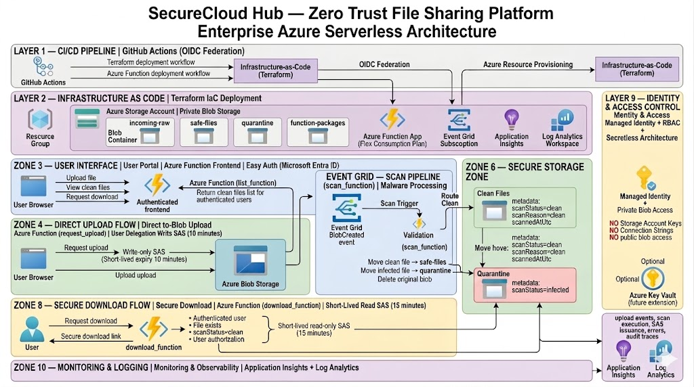

# Weather Tracker — Azure Compute, Containers, Monitoring Platform

Weather Tracker is a production-style Azure cloud engineering project that demonstrates how to build a cloud-native weather platform using Azure Container Apps, FastAPI, Docker, Terraform, Azure Monitor, Application Insights, Log Analytics, and GitHub Actions with OIDC.

It is designed to showcase practical Azure engineering skills for cloud, infrastructure, DevOps, and platform-focused roles.

## Architecture Overview

### Enterprise Architecture



Weather Tracker Architecture
---

## Project Summary

Weather Tracker demonstrates how to build a cloud-native application using containerized workloads, Infrastructure as Code, deployment automation, and centralized observability.

The platform allows users to retrieve weather information through a cloud-hosted application running inside Azure Container Apps while telemetry, monitoring, diagnostics, and alerting provide operational visibility across the environment.

The solution was designed to mirror modern cloud engineering patterns commonly used in scalable application platforms and operational environments.

---

## Key Objectives

- Deploy a cloud-native application using Azure Container Apps
- Containerize workloads using Docker
- Automate deployments through GitHub Actions
- Provision infrastructure using Terraform
- Centralize application telemetry
- Monitor application health and requests
- Implement operational visibility and alerting
- Demonstrate cloud engineering deployment workflows

---

## Technologies Used

- Azure Container Apps
- FastAPI
- Docker
- Terraform
- GitHub Actions
- OpenID Connect (OIDC)
- Azure Monitor
- Application Insights
- Log Analytics Workspace
- KQL

---

## Core Features

### Weather Search

Users can retrieve weather information dynamically through external weather API integrations.

### Containerized Cloud Deployment

Application workloads are packaged using Docker and hosted through Azure Container Apps.

### Infrastructure as Code

Azure resources are provisioned through Terraform for repeatable and version-controlled deployments.

### CI/CD Automation

GitHub Actions automatically builds, validates, and deploys application changes into Azure.

### Monitoring and Diagnostics

Application Insights, Azure Monitor, and Log Analytics provide centralized observability across the environment.

### Alerting Workflow

Azure Monitor alerts generate operational visibility for application health events and failures.

---

## Architecture Layers

- GitHub Actions OIDC Deployment Layer
- Terraform Infrastructure Layer
- Azure Container Apps Compute Layer
- FastAPI Application Layer
- External Weather API Layer
- Monitoring and Diagnostics Layer
- Application Insights Telemetry Layer
- Azure Monitor Alerting Layer
- Log Analytics Investigation Layer

---

## Deployment Evidence

Deployment screenshots and architecture assets are stored in:

```text
docs/screenshots/
docs/architecture/
```

These include:

- Azure Container App deployment
- GitHub Actions pipeline execution
- Terraform infrastructure deployment
- Application Insights traces
- Request telemetry
- Live Metrics monitoring
- Alert validation
- KQL investigation queries
- Operational dashboard screenshots

---

## Live Project Walkthrough

Architecture Overview:

https://oowusu.com/weather-tracker-azure.html

Technical Deep Dive:

https://oowusu.com/weather-tracker-azure-deepdive.html

---

## Deployment Approach

Infrastructure was deployed using Terraform and GitHub Actions with OpenID Connect federation to enable secure, repeatable, passwordless Azure deployments without long-lived client secrets.

Containerized workloads were built automatically and deployed into Azure Container Apps through CI/CD pipelines.

---

## Learning Outcomes

- Cloud-native Azure architecture
- Azure Container Apps deployment
- Docker container workflows
- Terraform Infrastructure as Code
- OIDC-based CI/CD pipelines
- Azure Monitor alerting
- Application Insights telemetry
- KQL investigation workflows
- Cloud troubleshooting and diagnostics
- Operational observability practices

---

## License

MIT License
